# FormBridge Implementation Status Report

**Date:** July 31, 2026  
**Version:** 1.0.0  
**Based on:** Document-Processing-Automation-Spec.pdf

---

## Executive Summary

This document provides a comprehensive analysis of the current FormBridge implementation against the original specification. The system has achieved core MVP functionality for document processing, OCR extraction, and review workflows. Several enterprise features remain to be implemented.

**Overall Progress:** ~60% complete (Core MVP functional, Enterprise features pending)

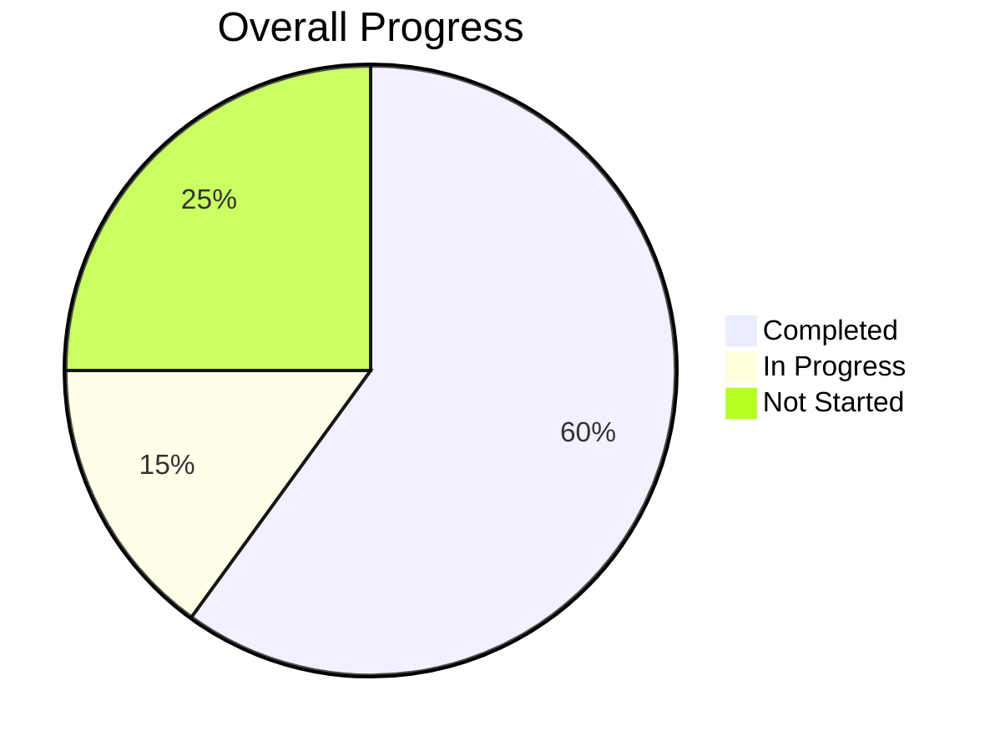
```mermaid
pie
    title Overall Progress
    "Completed" : 60
    "In Progress" : 15
    "Not Started" : 25
```

---

## Architecture Overview

### Current Architecture

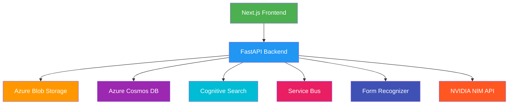
```mermaid
graph TB
    UI["Next.js Frontend"]
    API["FastAPI Backend"]
    Blob["Azure Blob Storage"]
    Cosmos["Azure Cosmos DB"]
    Search["Cognitive Search"]
    Bus["Service Bus"]
    Form["Form Recognizer"]
    NVIDIA["NVIDIA NIM API"]
    
    UI --> API
    API --> Blob
    API --> Cosmos
    API --> Search
    API --> Bus
    API --> Form
    API --> NVIDIA
    
    style UI fill:#4CAF50,color:#fff
    style API fill:#2196F3,color:#fff
    style Blob fill:#FF9800,color:#fff
    style Cosmos fill:#9C27B0,color:#fff
    style Search fill:#00BCD4,color:#fff
    style Bus fill:#E91E63,color:#fff
    style Form fill:#3F51B5,color:#fff
    style NVIDIA fill:#FF5722,color:#fff
```

### Spec Architecture (Target)

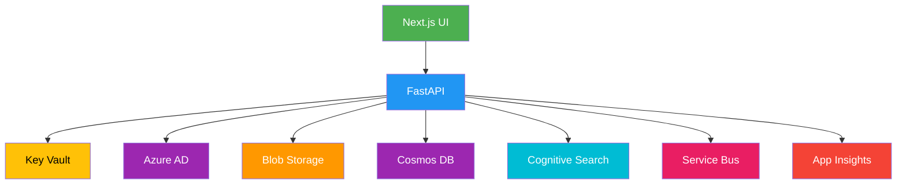
```mermaid
graph TB
    UI["Next.js UI"]
    API["FastAPI"]
    KV["Key Vault"]
    AD["Azure AD"]
    Blob["Blob Storage"]
    Cosmos["Cosmos DB"]
    Search["Cognitive Search"]
    Bus["Service Bus"]
    Insights["App Insights"]
    
    UI --> API
    API --> KV
    API --> AD
    API --> Blob
    API --> Cosmos
    API --> Search
    API --> Bus
    API --> Insights
    
    style UI fill:#4CAF50,color:#fff
    style API fill:#2196F3,color:#fff
    style KV fill:#FFC107,color:#000
    style AD fill:#9C27B0,color:#fff
    style Blob fill:#FF9800,color:#fff
    style Cosmos fill:#9C27B0,color:#fff
    style Search fill:#00BCD4,color:#fff
    style Bus fill:#E91E63,color:#fff
    style Insights fill:#F44336,color:#fff
```

---

## Component Implementation Status

### 1. Frontend (Next.js)

**Frontend Implementation Status**

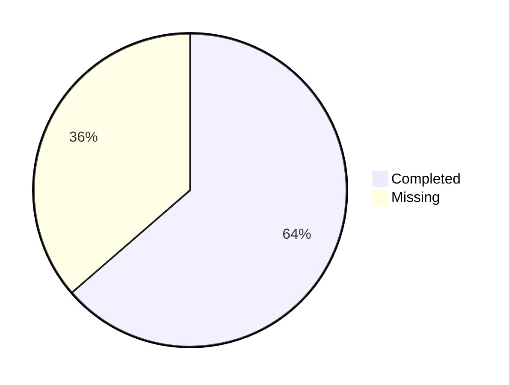
```mermaid
pie
    "Completed" : 7
    "Missing" : 4
```

| Component | Status | Notes |
|-----------|--------|-------|
| Upload Page | ✅ Complete | Direct upload via FastAPI |
| Documents Page | ✅ Complete | List view with search |
| Review Queue | ✅ Complete | Filters: search, type, status, date |
| Review Detail Page | ✅ Complete | Editable fields, PDF preview |
| Dashboard | ✅ Complete | Basic metrics |
| Processing Page | ✅ Complete | Status monitoring |
| Settings Page | ✅ Complete | Basic configuration |
| Search Page | ✅ Complete | Full-text search |
| PDF Viewer with Bounding Boxes | ❌ Missing | Spec requirement |
| Batch Actions | ❌ Missing | Approve/reject/assign |
| Audit Timeline | ❌ Missing | Per-document audit view |
| Role-based UI | ❌ Missing | RBAC not implemented |

### 2. Backend (FastAPI)

**Backend Implementation Status**

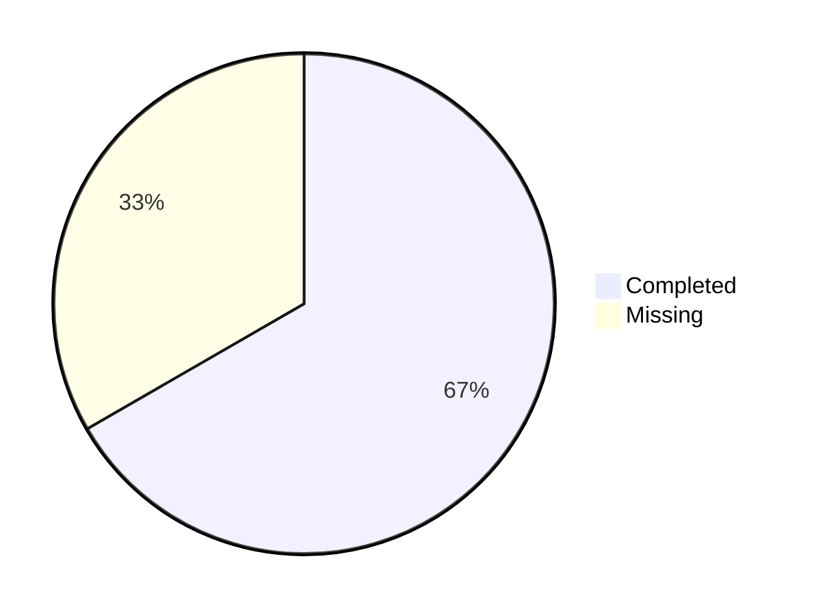
```mermaid
pie
    "Completed" : 8
    "Missing" : 4
```

| Component | Status | Notes |
|-----------|--------|-------|
| Document Upload | ✅ Complete | SAS URL generation |
| Document Processing | ✅ Complete | Azure Form Recognizer |
| AI Extraction Fallback | ✅ Complete | NVIDIA NIM API |
| Document Storage | ✅ Complete | Cosmos DB integration |
| Search Indexing | ✅ Complete | Cognitive Search |
| Review Queue API | ✅ Complete | Filtering implemented |
| Review Submission | ✅ Complete | Field correction |
| Download SAS | ✅ Complete | Presigned URLs |
| Export API | ❌ Missing | ERP/DMS integration |
| Webhook Handler | ❌ Missing | Inbound webhooks |
| Worker Service | ❌ Missing | Async processing |
| Business Rules | ❌ Missing | Validation logic |

### 3. Azure Services

**Azure Services Status**

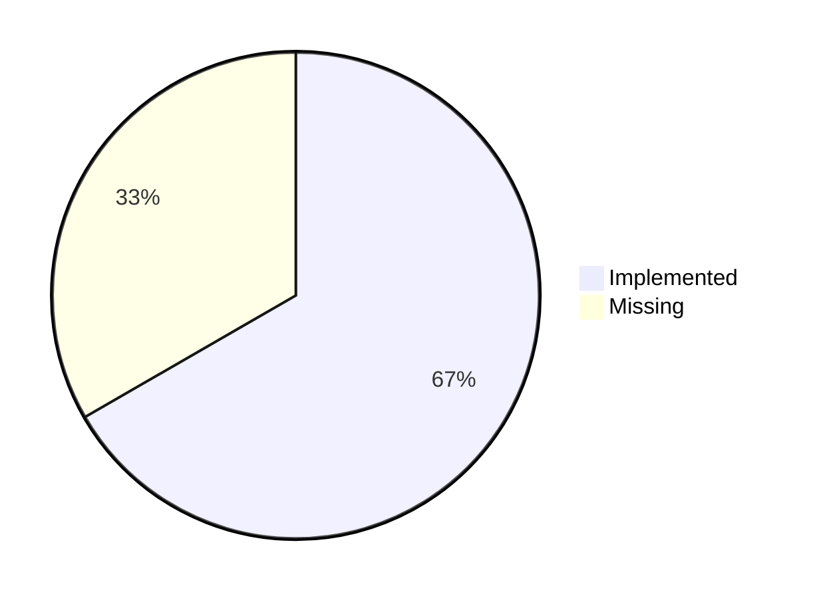
```mermaid
pie
    "Implemented" : 6
    "Missing" : 3
```

| Service | Status | Notes |
|---------|--------|-------|
| Blob Storage | ✅ Complete | incoming/processed/archive |
| Cosmos DB | ✅ Complete | Metadata storage |
| Cognitive Search | ✅ Complete | Full-text search |
| Service Bus | ✅ Complete | Event handling |
| Form Recognizer | ✅ Complete | OCR/extraction |
| Key Vault | ❌ Missing | Secret management |
| Azure AD/B2C | ❌ Missing | Using custom JWT |
| Application Insights | ❌ Missing | No monitoring |
| Private Endpoints | ❌ Missing | Public endpoints |

---

## API Implementation Status

### Implemented Endpoints

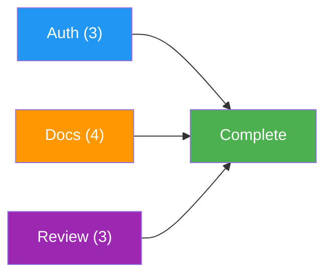
```mermaid
graph LR
    Auth["Auth (3)"]
    Docs["Docs (4)"]
    Review["Review (3)"]
    
    Auth --> Complete
    Docs --> Complete
    Review --> Complete
    
    style Complete fill:#4CAF50,color:#fff
    style Auth fill:#2196F3,color:#fff
    style Docs fill:#FF9800,color:#fff
    style Review fill:#9C27B0,color:#fff
```

| Method | Endpoint | Status | Description |
|--------|----------|--------|-------------|
| POST | /api/auth/register | ✅ | User registration |
| POST | /api/auth/login | ✅ | User login (JWT) |
| GET | /api/auth/me | ✅ | Current user info |
| POST | /api/documents/upload | ✅ | Upload document |
| GET | /api/documents/{id} | ✅ | Get document details |
| DELETE | /api/documents/{id} | ✅ | Delete document |
| GET | /api/documents/{id}/download | ✅ | Download SAS URL |
| GET | /api/documents | ✅ | Search documents |
| GET | /api/review/queue | ✅ | Get review queue |
| GET | /api/review/{id} | ✅ | Get review document |
| POST | /api/review/{id}/submit | ✅ | Submit review |

### Missing Endpoints

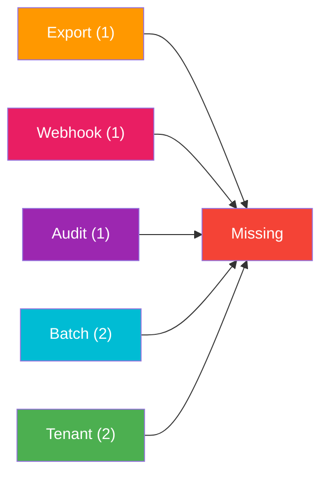
```mermaid
graph LR
    Export["Export (1)"]
    Webhook["Webhook (1)"]
    Audit["Audit (1)"]
    Batch["Batch (2)"]
    Tenant["Tenant (2)"]
    
    Export --> Missing
    Webhook --> Missing
    Audit --> Missing
    Batch --> Missing
    Tenant --> Missing
    
    style Missing fill:#F44336,color:#fff
    style Export fill:#FF9800,color:#fff
    style Webhook fill:#E91E63,color:#fff
    style Audit fill:#9C27B0,color:#fff
    style Batch fill:#00BCD4,color:#fff
    style Tenant fill:#4CAF50,color:#fff
```

| Method | Endpoint | Priority | Description |
|--------|----------|----------|-------------|
| POST | /api/export/{id}/trigger | High | Trigger export to ERP/DMS |
| POST | /api/webhook/inbound | Medium | Handle inbound webhooks |
| GET | /api/audit/{id} | Medium | Get audit trail |
| POST | /api/batch/approve | Medium | Batch approve documents |
| POST | /api/batch/reject | Medium | Batch reject documents |
| GET | /api/tenants | Low | List tenants (multi-tenant) |
| POST | /api/tenants | Low | Create tenant |

---

## Data Model Comparison

### Current Document Schema

```json
{
  "id": "guid",
  "tenantId": "string",
  "blobUri": "https://...",
  "filename": "string",
  "contentType": "application/pdf",
  "documentType": "invoice|receipt|contract|other",
  "extractedFields": {
    "dynamic_field_1": "value",
    "dynamic_field_2": 123.45,
    "lineItems": [...]
  },
  "confidenceScores": {
    "field_name": 0.95
  },
  "status": "ingested|processing|needs_review|validated|failed",
  "createdBy": "userId",
  "createdAt": "2026-07-30T12:00:00Z",
  "audit": [...],
  "ocrText": "...",
  "keyValuePairs": {...}
}
```

### Spec Document Schema

```json
{
  "id": "guid",
  "tenantId": "string",
  "blobUri": "https://...",
  "filename": "string",
  "contentType": "application/pdf",
  "documentType": "invoice|receipt|contract|other",
  "extractedFields": {
    "vendorName": "string",
    "invoiceNumber": "string",
    "invoiceDate": "YYYY-MM-DD",
    "totalAmount": 1234.56,
    "currency": "USD",
    "lineItems": [
      {
        "description": "",
        "qty": 1,
        "unitPrice": 12.34,
        "amount": 12.34
      }
    ]
  },
  "confidenceScores": {
    "vendorName": 0.98,
    "totalAmount": 0.95
  },
  "status": "ingested|processing|needs_review|validated|exported|archived",
  "createdBy": "userId",
  "createdAt": "2026-07-30T12:00:00Z",
  "audit": [
    {
      "actor": "userId",
      "action": "ingest",
      "timestamp": "..."
    }
  ]
}
```

### Schema Differences

| Field | Current | Spec | Status |
|-------|---------|------|--------|
| extractedFields | Dynamic | Structured | ✅ Better (dynamic) |
| confidenceScores | Dict | Dict | ✅ Match |
| status | 5 states | 7 states | ⚠️ Missing: exported, archived |
| audit | Basic | Full | ⚠️ Needs enhancement |
| tenantId | Present | Present | ✅ Match |
| lineItems | Dynamic | Structured | ⚠️ Needs standardization |

---

## Feature Implementation Matrix

### Core Features

**Core Features Implementation**

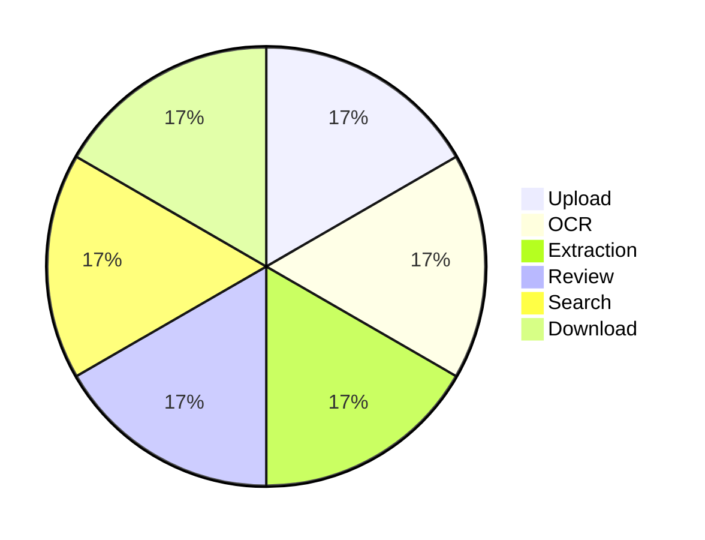
```mermaid
pie
    "Upload" : 100
    "OCR" : 100
    "Extraction" : 100
    "Review" : 100
    "Search" : 100
    "Download" : 100
```

| Feature | Status | Completion |
|---------|--------|------------|
| Document Upload | ✅ | 100% |
| OCR Processing | ✅ | 100% |
| Field Extraction | ✅ | 100% |
| Confidence Scoring | ✅ | 100% |
| Review Queue | ✅ | 100% |
| Field Editing | ✅ | 100% |
| Search | ✅ | 100% |
| Download | ✅ | 100% |
| Delete | ✅ | 100% |

### Enterprise Features

**Enterprise Features Implementation**

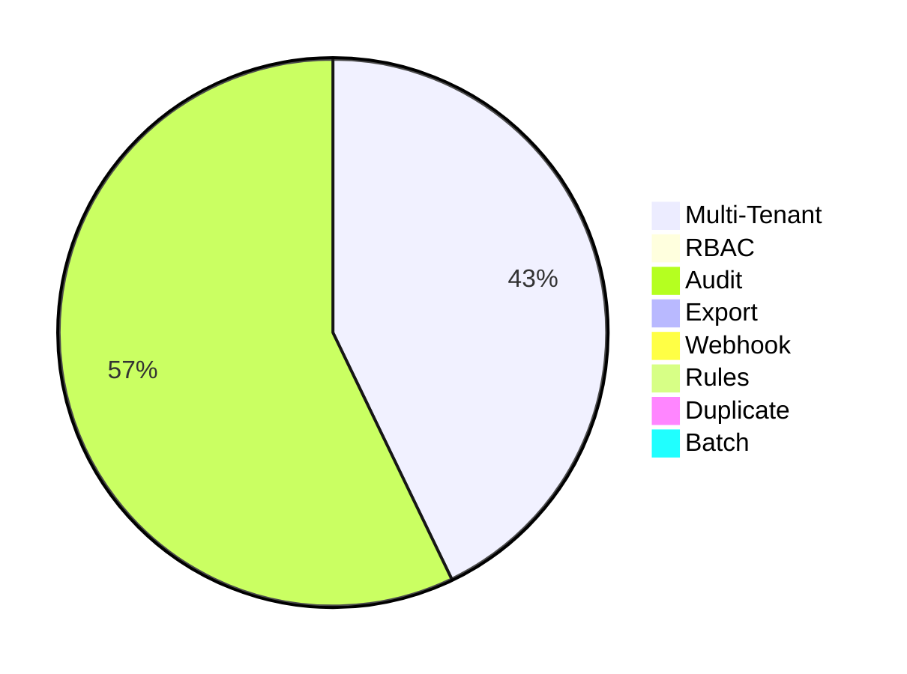
```mermaid
pie
    "Multi-Tenant" : 30
    "RBAC" : 0
    "Audit" : 40
    "Export" : 0
    "Webhook" : 0
    "Rules" : 0
    "Duplicate" : 0
    "Batch" : 0
```

| Feature | Status | Completion |
|---------|--------|------------|
| Multi-tenant Support | ⚠️ Partial | 30% |
| Role-based Access | ❌ Missing | 0% |
| Audit Trail | ⚠️ Partial | 40% |
| Export Integration | ❌ Missing | 0% |
| Webhook Support | ❌ Missing | 0% |
| Business Rules | ❌ Missing | 0% |
| Duplicate Detection | ❌ Missing | 0% |
| Batch Operations | ❌ Missing | 0% |
| Monitoring | ❌ Missing | 0% |
| Secret Management | ❌ Missing | 0% |

### Security Features

**Security Features Implementation**

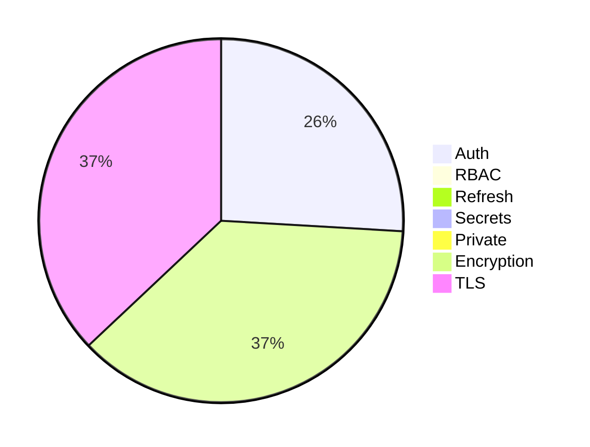
```mermaid
pie
    "Auth" : 70
    "RBAC" : 0
    "Refresh" : 0
    "Secrets" : 0
    "Private" : 0
    "Encryption" : 100
    "TLS" : 100
```

| Feature | Status | Completion |
|---------|--------|------------|
| Authentication | ✅ Custom JWT | 70% |
| Authorization | ❌ Missing | 0% |
| Token Refresh | ❌ Missing | 0% |
| Secret Storage | ❌ Missing | 0% |
| Private Endpoints | ❌ Missing | 0% |
| Encryption at Rest | ✅ Azure | 100% |
| TLS in Transit | ✅ Azure | 100% |

---

## Detailed Gap Analysis

### High Priority Gaps

#### 1. Azure Key Vault Integration
**Why:** Hardcoded secrets in .env files are insecure and not production-ready.
**Impact:** Security risk, compliance violation.
**Effort:** 2-3 days
**Dependencies:** None

#### 2. Azure AD/B2C Authentication
**Why:** Custom JWT lacks enterprise features, SSO, and proper identity management.
**Impact:** Security, user management, compliance.
**Effort:** 5-7 days
**Dependencies:** Key Vault

#### 3. Worker Service (Azure Functions/AKS)
**Why:** Current synchronous processing doesn't scale and blocks API responses.
**Impact:** Scalability, reliability, performance.
**Effort:** 10-14 days
**Dependencies:** Service Bus, monitoring

#### 4. Export Integration
**Why:** No way to send processed documents to ERP/DMS systems.
**Impact:** Business value, automation.
**Effort:** 7-10 days
**Dependencies:** Worker service

#### 5. Application Insights
**Why:** No monitoring, alerting, or observability.
**Impact:** Operations, debugging, reliability.
**Effort:** 3-5 days
**Dependencies:** None

### Medium Priority Gaps

#### 6. Business Rules Engine
**Why:** No validation logic (date ranges, amount matching, vendor validation).
**Impact:** Data quality, accuracy.
**Effort:** 5-7 days
**Dependencies:** None

#### 7. Duplicate Detection
**Why:** Can't identify duplicate invoices/documents.
**Impact:** Data integrity, cost savings.
**Effort:** 3-5 days
**Dependencies:** Search service

#### 8. Batch Operations
**Why:** Manual review of each document is inefficient.
**Impact:** Productivity, user experience.
**Effort:** 3-4 days
**Dependencies:** Review queue API

#### 9. Audit Trail Enhancement
**Why:** Current audit is basic, lacks full history and compliance features.
**Impact:** Compliance, debugging.
**Effort:** 2-3 days
**Dependencies:** None

#### 10. Webhook Support
**Why:** No way to integrate with external systems.
**Impact:** Integration capabilities.
**Effort:** 3-4 days
**Dependencies:** Worker service

### Low Priority Gaps

#### 11. Private Endpoints
**Why:** Public endpoints are acceptable for many use cases.
**Impact:** Security (network level).
**Effort:** 5-7 days
**Dependencies:** VNet setup

#### 12. Role-based UI
**Why:** Current UI doesn't adapt to user roles.
**Impact:** User experience, security.
**Effort:** 4-5 days
**Dependencies:** RBAC backend

#### 13. PDF Bounding Boxes
**Why:** Nice-to-have for review UX.
**Impact:** User experience.
**Effort:** 5-7 days
**Dependencies:** Form Recognizer API

---

## Implementation Roadmap

**Implementation Timeline**

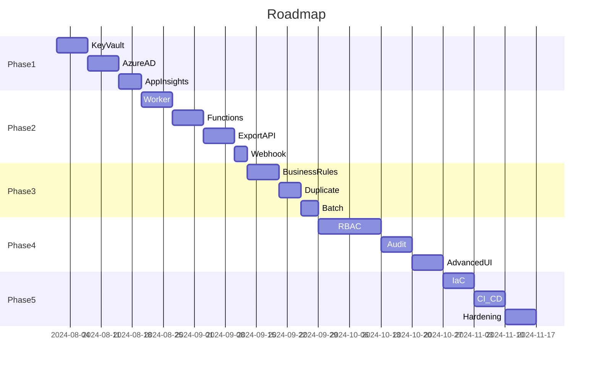
```mermaid
gantt
    title Roadmap
    dateFormat  YYYY-MM-DD
    section Phase1
    KeyVault       :a1, 2024-08-01, 7d
    AzureAD         :a2, after a1, 7d
    AppInsights     :a3, after a2, 5d
    section Phase2
    Worker          :b1, after a3, 7d
    Functions       :b2, after b1, 7d
    ExportAPI       :b3, after b2, 7d
    Webhook         :b4, after b3, 3d
    section Phase3
    BusinessRules   :c1, after b4, 7d
    Duplicate       :c2, after c1, 5d
    Batch           :c3, after c2, 4d
    section Phase4
    RBAC            :d1, after c3, 14d
    Audit           :d2, after d1, 7d
    AdvancedUI      :d3, after d2, 7d
    section Phase5
    IaC             :e1, after d3, 7d
    CI_CD           :e2, after e1, 7d
    Hardening       :e3, after e2, 7d
```

### Phase 1: Security & Monitoring (2-3 weeks)
**Goal:** Production-ready security and observability

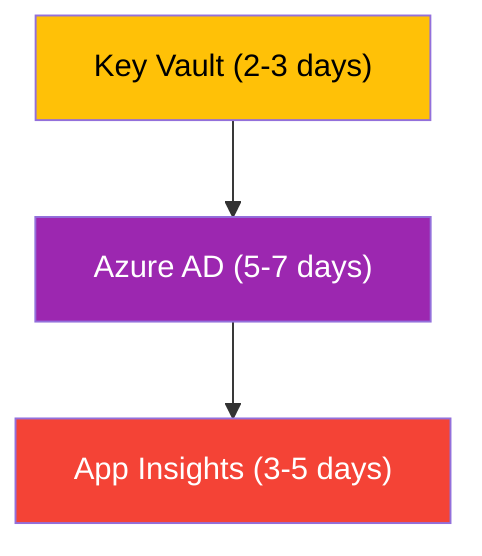
```mermaid
graph TD
    KV["Key Vault (2-3 days)"]
    AD["Azure AD (5-7 days)"]
    Insights["App Insights (3-5 days)"]
    
    KV --> AD
    AD --> Insights
    
    style KV fill:#FFC107,color:#000
    style AD fill:#9C27B0,color:#fff
    style Insights fill:#F44336,color:#fff
```

1. **Week 1: Security**
   - Implement Azure Key Vault integration
   - Migrate all secrets to Key Vault
   - Update config to use Managed Identity

2. **Week 2: Authentication**
   - Implement Azure AD/B2C integration
   - Replace custom JWT with Azure AD tokens
   - Implement token refresh mechanism

3. **Week 3: Monitoring**
   - Add Application Insights to backend
   - Add Application Insights to frontend
   - Set up basic alerts and dashboards

### Phase 2: Scalability & Processing (3-4 weeks)
**Goal:** Asynchronous, scalable processing

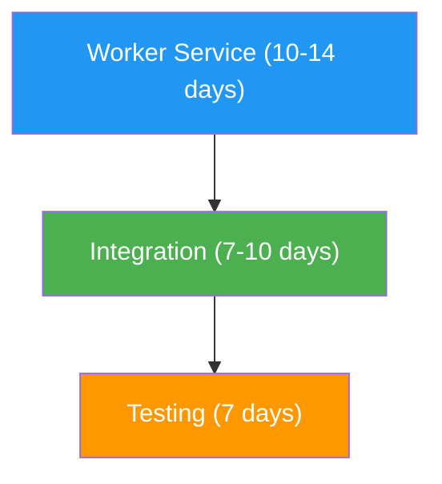
```mermaid
graph TD
    Worker["Worker Service (10-14 days)"]
    Integration["Integration (7-10 days)"]
    Testing["Testing (7 days)"]
    
    Worker --> Integration
    Integration --> Testing
    
    style Worker fill:#2196F3,color:#fff
    style Integration fill:#4CAF50,color:#fff
    style Testing fill:#FF9800,color:#fff
```

1. **Week 1-2: Worker Service**
   - Design Azure Functions architecture
   - Implement blob trigger functions
   - Implement Service Bus processing
   - Add error handling and retries

2. **Week 3: Integration**
   - Implement export API endpoints
   - Add webhook handler
   - Create integration templates (SFTP, CSV)

3. **Week 4: Testing**
   - Load testing
   - Failure scenario testing
   - Performance optimization

### Phase 3: Business Logic & Validation (2-3 weeks)
**Goal:** Data quality and business rules

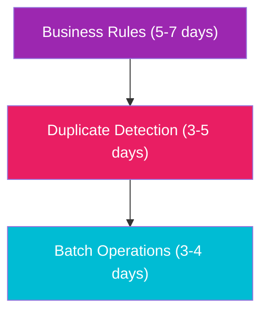
```mermaid
graph TD
    Rules["Business Rules (5-7 days)"]
    Duplicate["Duplicate Detection (3-5 days)"]
    Batch["Batch Operations (3-4 days)"]
    
    Rules --> Duplicate
    Duplicate --> Batch
    
    style Rules fill:#9C27B0,color:#fff
    style Duplicate fill:#E91E63,color:#fff
    style Batch fill:#00BCD4,color:#fff
```

1. **Week 1: Business Rules**
   - Implement validation engine
   - Add date range validation
   - Add amount matching logic
   - Add vendor fuzzy matching

2. **Week 2: Duplicate Detection**
   - Implement duplicate detection algorithm
   - Add duplicate flag in UI
   - Add merge/resolve workflow

3. **Week 3: Batch Operations**
   - Implement batch approve/reject
   - Add bulk assignment
   - Optimize queue operations

### Phase 4: Enterprise Features (3-4 weeks)
**Goal:** Full enterprise feature set

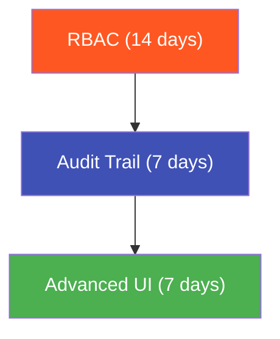
```mermaid
graph TD
    RBAC["RBAC (14 days)"]
    Audit["Audit Trail (7 days)"]
    UI["Advanced UI (7 days)"]
    
    RBAC --> Audit
    Audit --> UI
    
    style RBAC fill:#FF5722,color:#fff
    style Audit fill:#3F51B5,color:#fff
    style UI fill:#4CAF50,color:#fff
```

1. **Week 1-2: RBAC**
   - Implement role-based access control
   - Add role management UI
   - Update UI based on roles
   - Implement tenant scoping

2. **Week 3: Audit Trail**
   - Enhance audit logging
   - Add audit timeline UI
   - Implement audit export
   - Add compliance features

3. **Week 4: Advanced UI**
   - Add PDF bounding box highlights
   - Implement advanced filters
   - Add custom views
   - Improve UX

### Phase 5: Infrastructure & DevOps (2-3 weeks)
**Goal:** Production deployment and CI/CD

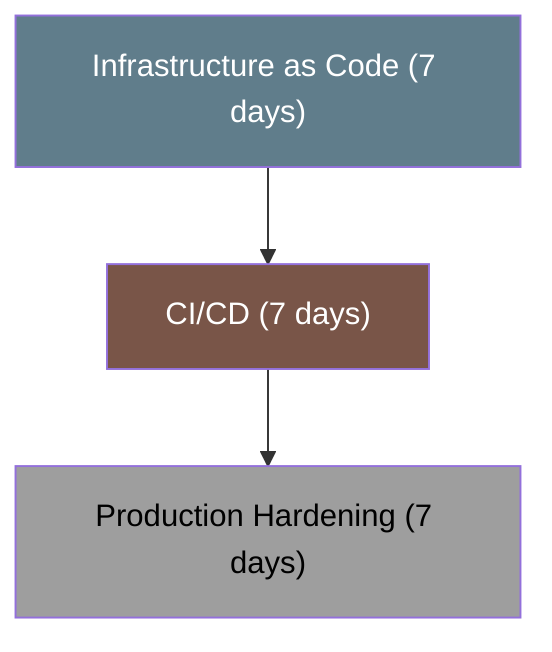
```mermaid
graph TD
    IaC["Infrastructure as Code (7 days)"]
    CI["CI/CD (7 days)"]
    Prod["Production Hardening (7 days)"]
    
    IaC --> CI
    CI --> Prod
    
    style IaC fill:#607D8B,color:#fff
    style CI fill:#795548,color:#fff
    style Prod fill:#9E9E9E,color:#000
```

1. **Week 1: Infrastructure as Code**
   - Create Bicep/Terraform templates
   - Set up resource groups
   - Configure networking
   - Set up Private Endpoints

2. **Week 2: CI/CD**
   - Create GitHub Actions workflows
   - Set up automated testing
   - Configure deployment pipelines
   - Add environment promotion

3. **Week 3: Production Hardening**
   - Security hardening
   - Performance tuning
   - Disaster recovery setup
   - Documentation

---

## Technical Debt

### Current Technical Debt

1. **Hardcoded Configuration**
   - Secrets in .env files
   - No environment-specific configs
   - No feature flags

2. **Synchronous Processing**
   - Blocking API calls
   - No queue depth management
   - No retry logic

3. **Limited Error Handling**
   - Basic try-catch blocks
   - No structured error responses
   - No error tracking

4. **No Testing**
   - No unit tests
   - No integration tests
   - No E2E tests

5. **Limited Logging**
   - Basic print statements
   - No structured logging
   - No log aggregation

### Debt Resolution Priority

| Debt Item | Priority | Effort | Impact |
|-----------|----------|--------|--------|
| Hardcoded secrets | High | 2 days | Security |
| Synchronous processing | High | 2 weeks | Scalability |
| No testing | High | 3 weeks | Quality |
| Limited error handling | Medium | 1 week | Reliability |
| Limited logging | Medium | 3 days | Operations |

---

## Configuration Comparison

### Current Configuration

```python
class Settings(BaseSettings):
    # Application
    app_name: str = "FormBridge API"
    app_version: str = "1.0.0"
    debug: bool = True
    
    # Azure Storage
    azure_storage_account_url: str
    azure_storage_account_name: str
    azure_storage_account_key: str
    azure_storage_container_incoming: str = "incoming"
    azure_storage_container_processed: str = "processed"
    azure_storage_container_archive: str = "archive"
    
    # Azure Document Intelligence
    azure_document_intelligence_endpoint: str
    azure_document_intelligence_key: str
    
    # Azure Cognitive Search
    azure_search_endpoint: str
    azure_search_key: str
    azure_search_index_name: str = "documents"
    
    # Azure Cosmos DB
    azure_cosmos_endpoint: str
    azure_cosmos_key: str
    azure_cosmos_database_name: str = "formbridge"
    azure_cosmos_container_name: str = "documents"
    
    # Azure Service Bus
    azure_service_bus_connection_string: str
    azure_service_bus_queue_name: str = "document-processing"
    
    # Authentication
    jwt_secret_key: str
    jwt_algorithm: str = "HS256"
    jwt_access_token_expire_minutes: int = 10080  # 7 days
    
    # NVIDIA NIM API
    nvidia_nim_api_key: Optional[str] = None
    nvidia_nim_model: str = "deepseek-ai/deepseek-v4-pro"
```

### Missing Configuration

```python
# Azure Key Vault
azure_key_vault_url: str
use_managed_identity: bool = True

# Azure AD / B2C
azure_ad_tenant_id: str
azure_ad_client_id: str
azure_ad_client_secret: str
azure_ad_domain: str

# Application Insights
app_insights_connection_string: str
app_insights_instrumentation_key: str

# Private Endpoints
use_private_endpoints: bool = False
vnet_resource_group: str
vnet_name: str

# Business Rules
invoice_date_validation_days: int = 730  # 2 years
amount_tolerance_percent: float = 5.0
enable_duplicate_detection: bool = True

# Export Configuration
export_sftp_host: Optional[str] = None
export_sftp_port: int = 22
export_sftp_username: Optional[str] = None
export_sftp_password: Optional[str] = None
export_webhook_url: Optional[str] = None
```

---

## Database Schema Comparison

### Current Cosmos DB Schema

**Container:** documents  
**Partition Key:** /tenantId

```json
{
  "id": "guid",
  "tenantId": "string",
  "blobUri": "string",
  "filename": "string",
  "contentType": "string",
  "documentType": "string",
  "extractedFields": {},
  "confidenceScores": {},
  "status": "string",
  "createdBy": "string",
  "createdAt": "datetime",
  "audit": [],
  "ocrText": "string",
  "keyValuePairs": {}
}
```

### Missing Containers

**users** - User management
```json
{
  "id": "guid",
  "email": "string",
  "firstName": "string",
  "lastName": "string",
  "role": "string",
  "tenantId": "string",
  "isActive": true,
  "createdAt": "datetime",
  "updatedAt": "datetime"
}
```

**tenants** - Multi-tenant management
```json
{
  "id": "guid",
  "name": "string",
  "domain": "string",
  "settings": {},
  "isActive": true,
  "createdAt": "datetime",
  "updatedAt": "datetime"
}
```

**audit** - Detailed audit trail
```json
{
  "id": "guid",
  "documentId": "string",
  "actor": "string",
  "action": "string",
  "changes": {},
  "timestamp": "datetime",
  "ipAddress": "string",
  "userAgent": "string"
}
```

**export_jobs** - Export tracking
```json
{
  "id": "guid",
  "documentId": "string",
  "target": "string",
  "status": "pending|completed|failed",
  "attemptCount": 0,
  "lastAttempt": "datetime",
  "error": "string",
  "createdAt": "datetime"
}
```

---

## Search Index Comparison

### Current Search Index

**Index:** documents  
**Fields:**
- id (Edm.String)
- filename (Edm.String, searchable)
- documentType (Edm.String, filterable)
- status (Edm.String, filterable)
- extractedFields (Edm.String, searchable)
- ocrText (Edm.String, searchable)
- createdAt (Edm.DateTimeOffset, filterable, sortable)

### Missing Search Fields

- vendorName (Edm.String, searchable, filterable)
- invoiceNumber (Edm.String, searchable, filterable)
- invoiceDate (Edm.DateTimeOffset, filterable, sortable)
- totalAmount (Edm.Double, filterable, sortable)
- confidenceScore (Edm.Double, filterable, sortable)
- tenantId (Edm.String, filterable)
- createdBy (Edm.String, filterable)
- tags (Collection(Edm.String), filterable)

---

## Data Flow Diagram

### Current Document Processing Flow

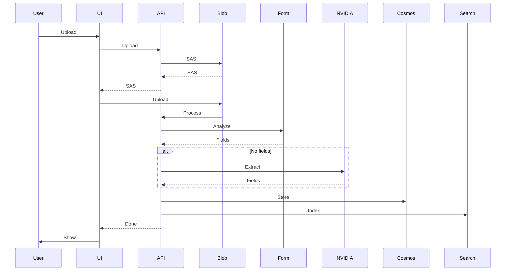
```mermaid
sequenceDiagram
    participant User
    participant UI
    participant API
    participant Blob
    participant Form
    participant NVIDIA
    participant Cosmos
    participant Search
    
    User->>UI: Upload
    UI->>API: Upload
    API->>Blob: SAS
    Blob-->>API: SAS
    API-->>UI: SAS
    UI->>Blob: Upload
    Blob->>API: Process
    API->>Form: Analyze
    Form-->>API: Fields
    alt No fields
        API->>NVIDIA: Extract
        NVIDIA-->>API: Fields
    end
    API->>Cosmos: Store
    API->>Search: Index
    API-->>UI: Done
    UI->>User: Show
```

### Target Processing Flow (with Worker Service)

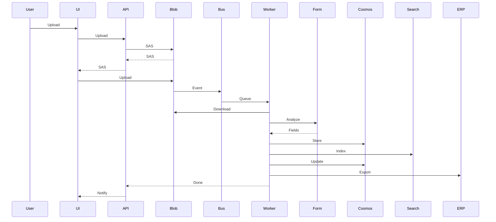
```mermaid
sequenceDiagram
    participant User
    participant UI
    participant API
    participant Blob
    participant Bus
    participant Worker
    participant Form
    participant Cosmos
    participant Search
    participant ERP
    
    User->>UI: Upload
    UI->>API: Upload
    API->>Blob: SAS
    Blob-->>API: SAS
    API-->>UI: SAS
    UI->>Blob: Upload
    Blob->>Bus: Event
    Bus->>Worker: Queue
    Worker->>Blob: Download
    Worker->>Form: Analyze
    Form-->>Worker: Fields
    Worker->>Cosmos: Store
    Worker->>Search: Index
    Worker->>Cosmos: Update
    Worker->>ERP: Export
    Worker-->>API: Done
    API-->>UI: Notify
```

---

## Cost Analysis

### Current Azure Services (Estimated Monthly)

**Current Monthly Cost Distribution**

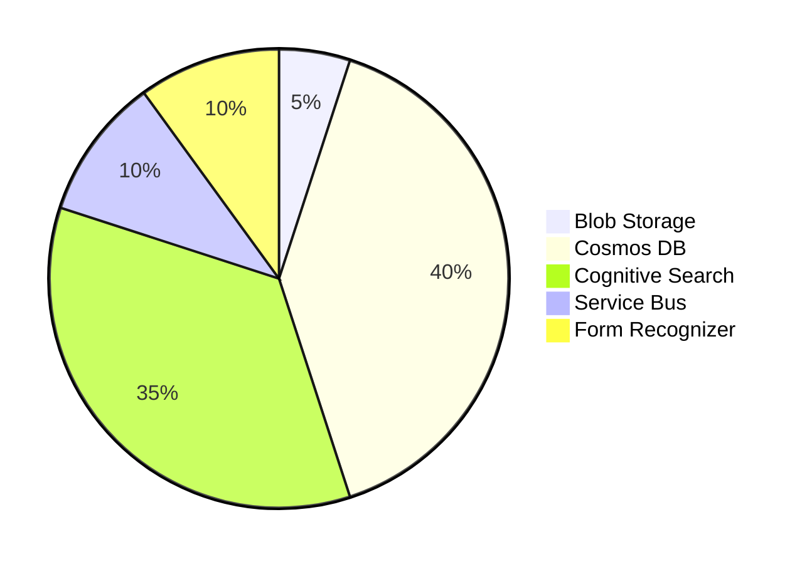
```mermaid
pie
    "Blob Storage" : 5
    "Cosmos DB" : 40
    "Cognitive Search" : 35
    "Service Bus" : 10
    "Form Recognizer" : 10
```

| Service | Tier | Est. Cost |
|---------|------|-----------|
| Blob Storage | Standard LRS | $0.02/GB |
| Cosmos DB | Standard | $25/1000 RU |
| Cognitive Search | Standard | $75/month |
| Service Bus | Standard | $0.10/million ops |
| Form Recognizer | S0 | $1.50/1000 pages |
| Static Web Apps | Free | $0 |
| App Service | Free/Basic | $0-75 |

**Total Current:** ~$175-250/month (low usage)

### Additional Services Needed

**Additional Monthly Cost Distribution**

```mermaid
pie
    "Key Vault" : 5
    "Azure AD" : 20
    "App Insights" : 25
    "Functions" : 30
    "Private Endpoints" : 20
```

| Service | Tier | Est. Cost | Priority |
|---------|------|-----------|----------|
| Key Vault | Standard | $0.03/10K ops | High |
| Azure AD | Free/P1 | $0-6/user | High |
| Application Insights | Standard | $2.30/GB | High |
| Functions | Consumption | $0.20/GB-s | High |
| Private Endpoints | Standard | $0.01/hour | Low |

**Total Additional:** ~$50-100/month

---

## Risk Assessment Matrix

```mermaid
graph TB
    subgraph High_Risk["High Risk"]
        R1["Security Risk"]
        R2["Scalability Risk"]
        R3["Data Quality Risk"]
    end
    
    subgraph Medium_Risk["Medium Risk"]
        R4["Operational Risk"]
        R5["Integration Risk"]
        R6["Compliance Risk"]
    end
    
    subgraph Low_Risk["Low Risk"]
        R7["Network Risk"]
        R8["UX Risk"]
        R9["Review Risk"]
    end
    
    style High_Risk fill:#F44336,color:#fff
    style Medium_Risk fill:#FF9800,color:#000
    style Low_Risk fill:#FFC107,color:#000
    style R1 fill:#B71C1C,color:#fff
    style R2 fill:#B71C1C,color:#fff
    style R3 fill:#B71C1C,color:#fff
    style R4 fill:#E65100,color:#fff
    style R5 fill:#E65100,color:#fff
    style R6 fill:#E65100,color:#fff
    style R7 fill:#F57F17,color:#fff
    style R8 fill:#F57F17,color:#fff
    style R9 fill:#F57F17,color:#fff
```

### High Risks

| Risk | Impact | Likelihood | Mitigation |
|------|--------|------------|------------|
| Security Risk | High | High | Implement Key Vault and Azure AD |
| Scalability Risk | High | Medium | Implement Azure Functions |
| Data Quality Risk | High | Medium | Implement validation engine |

### Medium Risks

| Risk | Impact | Likelihood | Mitigation |
|------|--------|------------|------------|
| Operational Risk | Medium | High | Add Application Insights |
| Integration Risk | Medium | Medium | Implement export API |
| Compliance Risk | Medium | Low | Enhance audit logging |

---

## Technical Debt Priority Matrix

**Technical Debt Priority**

```mermaid
pie
    "Hardcoded Secrets" : 20
    "Sync Processing" : 40
    "No Testing" : 25
    "Error Handling" : 10
    "Limited Logging" : 5
```

| Debt Item | Priority | Effort | Impact |
|-----------|----------|--------|--------|
| Hardcoded secrets | High | 2 days | Security |
| Synchronous processing | High | 2 weeks | Scalability |
| No testing | High | 3 weeks | Quality |
| Limited error handling | Medium | 1 week | Reliability |
| Limited logging | Medium | 3 days | Operations |

---

## Success Metrics Dashboard

### Current vs Target Metrics

```mermaid
graph LR
    subgraph Current["Current Status"]
        M1["Documents/day"]
        M2["Auto-validated %"]
        M3["Processing latency"]
        M4["Field accuracy"]
    end
    
    subgraph Target["Spec Targets"]
        T1["1000+"]
        T2["80%+"]
        T3["<30s"]
        T4["95%+"]
    end
    
    M1 -.-> T1
    M2 -.-> T2
    M3 -.-> T3
    M4 -.-> T4
    
    style Current fill:#FFC107,color:#000
    style Target fill:#4CAF50,color:#fff
    style M1 fill:#F44336,color:#fff
    style M2 fill:#F44336,color:#fff
    style M3 fill:#F44336,color:#fff
    style M4 fill:#F44336,color:#fff
```

### Metrics to Implement

| Metric | Spec Target | Current | Status |
|--------|-------------|---------|--------|
| Documents per day | 1000+ | Unknown | ❌ Not measured |
| Auto-validated % | 80%+ | Unknown | ❌ Not measured |
| Processing latency | <30s | Unknown | ❌ Not measured |
| Field accuracy | 95%+ | Unknown | ❌ Not measured |
| Manual review time | - | Unknown | ❌ Not measured |
| Cost per document | <$0.10 | Unknown | ❌ Not measured |

---

## Database Schema Diagram

### Current Cosmos DB Structure

```mermaid
erDiagram
    DOCUMENTS {
        string id
        string tenantId
        string blobUri
        string filename
        string contentType
        string documentType
        object extractedFields
        object confidenceScores
        string status
        string createdBy
        datetime createdAt
        array audit
        string ocrText
        object keyValuePairs
    }
    
    USERS {
        string id
        string email
        string firstName
        string lastName
        string password
        datetime createdAt
        datetime updatedAt
    }
    
    DOCUMENTS ||--o{ USERS : creates
```

### Target Cosmos DB Structure

```mermaid
erDiagram
    DOCUMENTS {
        string id
        string tenantId
        string blobUri
        string filename
        string contentType
        string documentType
        object extractedFields
        object confidenceScores
        string status
        string createdBy
        datetime createdAt
        datetime updatedAt
    }
    
    USERS {
        string id
        string email
        string firstName
        string lastName
        string role
        string tenantId
        boolean isActive
        datetime createdAt
        datetime updatedAt
    }
    
    TENANTS {
        string id
        string name
        string domain
        object settings
        boolean isActive
        datetime createdAt
        datetime updatedAt
    }
    
    AUDIT {
        string id
        string documentId
        string actor
        string action
        object changes
        datetime timestamp
        string ipAddress
        string userAgent
    }
    
    EXPORT_JOBS {
        string id
        string documentId
        string target
        string status
        int attemptCount
        datetime lastAttempt
        string error
        datetime createdAt
    }
    
    TENANTS ||--o{ DOCUMENTS : contains
    TENANTS ||--o{ USERS : has
    USERS ||--o{ DOCUMENTS : creates
    DOCUMENTS ||--o{ AUDIT : has
    DOCUMENTS ||--o{ EXPORT_JOBS : has
    USERS ||--o{ AUDIT : performs
```

---

## Deployment Architecture

### Current Deployment

```mermaid
graph TB
    Dev["Developer"]
    Git["GitHub"]
    Local["Local Dev"]
    
    Dev --> Git
    Git --> Local
    
    style Dev fill:#4CAF50,color:#fff
    style Git fill:#2196F3,color:#fff
    style Local fill:#FF9800,color:#fff
```

### Target Deployment

```mermaid
graph TB
    Dev["Developer"]
    Git["GitHub"]
    GHA["GitHub Actions"]
    ACR["Container Registry"]
    SWA["Static Web Apps"]
    App["App Service"]
    
    Dev --> Git
    Git --> GHA
    GHA --> ACR
    GHA --> SWA
    GHA --> App
    ACR --> App
    
    style Dev fill:#4CAF50,color:#fff
    style Git fill:#2196F3,color:#fff
    style GHA fill:#9C27B0,color:#fff
    style ACR fill:#FF9800,color:#fff
    style SWA fill:#00BCD4,color:#fff
    style App fill:#E91E63,color:#fff
```

---

## Feature Comparison Timeline

**Feature Implementation Timeline**

```mermaid
pie
    "Q1" : 5
    "Q2" : 7
    "Q3" : 6
    "Q4" : 4
```

---

## Security Layers

### Current Security Implementation

```mermaid
graph TB
    subgraph Security_Layers["Security Layers"]
        L1["TLS"]
        L2["Encryption"]
        L3["Auth"]
        L4["Authorization"]
        L5["Secrets"]
        L6["Network"]
    end
    
    style L1 fill:#4CAF50,color:#fff
    style L2 fill:#4CAF50,color:#fff
    style L3 fill:#FFC107,color:#000
    style L4 fill:#F44336,color:#fff
    style L5 fill:#F44336,color:#fff
    style L6 fill:#F44336,color:#fff
```

### Target Security Implementation

```mermaid
graph TB
    subgraph Security_Layers["Security Layers"]
        L1["TLS"]
        L2["Encryption"]
        L3["Auth"]
        L4["Authorization"]
        L5["Secrets"]
        L6["Network"]
    end
    
    style L1 fill:#4CAF50,color:#fff
    style L2 fill:#4CAF50,color:#fff
    style L3 fill:#4CAF50,color:#fff
    style L4 fill:#4CAF50,color:#fff
    style L5 fill:#4CAF50,color:#fff
    style L6 fill:#4CAF50,color:#fff
```

---

## Integration Ecosystem

### Current Integrations

```mermaid
graph LR
    Core["FormBridge"]
    Form["Form Recognizer"]
    Blob["Blob Storage"]
    Cosmos["Cosmos DB"]
    Search["Cognitive Search"]
    Bus["Service Bus"]
    
    Core --> Form
    Core --> Blob
    Core --> Cosmos
    Core --> Search
    Core --> Bus
    
    style Core fill:#2196F3,color:#fff
    style Form fill:#4CAF50,color:#fff
    style Blob fill:#FF9800,color:#fff
    style Cosmos fill:#9C27B0,color:#fff
    style Search fill:#00BCD4,color:#fff
    style Bus fill:#E91E63,color:#fff
```

### Target Integrations

```mermaid
graph LR
    Core["FormBridge"]
    Form["Form Recognizer"]
    Blob["Blob Storage"]
    Cosmos["Cosmos DB"]
    Search["Cognitive Search"]
    Bus["Service Bus"]
    AD["Azure AD"]
    KV["Key Vault"]
    Insights["App Insights"]
    ERP["ERP"]
    Webhook["Webhooks"]
    
    Core --> Form
    Core --> Blob
    Core --> Cosmos
    Core --> Search
    Core --> Bus
    Core --> AD
    Core --> KV
    Core --> Insights
    Core --> ERP
    Core --> Webhook
    
    style Core fill:#2196F3,color:#fff
    style Form fill:#4CAF50,color:#fff
    style Blob fill:#FF9800,color:#fff
    style Cosmos fill:#9C27B0,color:#fff
    style Search fill:#00BCD4,color:#fff
    style Bus fill:#E91E63,color:#fff
    style AD fill:#FFC107,color:#000
    style KV fill:#FFC107,color:#000
    style Insights fill:#F44336,color:#fff
    style ERP fill:#795548,color:#fff
    style Webhook fill:#607D8B,color:#fff
```

---

## Recommendations Priority Chart

**Implementation Roadmap**

```mermaid
pie
    "Phase 1 Security" : 20
    "Phase 2 Scalability" : 25
    "Phase 3 Business Logic" : 20
    "Phase 4 Enterprise" : 20
    "Phase 5 Infrastructure" : 15
```

---

## Conclusion

The current FormBridge implementation has successfully delivered core MVP functionality for document processing, OCR extraction, and review workflows. The system is functional for development and testing environments but requires significant enhancements for production deployment.

**Key Strengths:**
- Dynamic field extraction (better than spec)
- NVIDIA NIM AI fallback (innovation beyond spec)
- Working review queue with filters
- Full-text search capability
- Basic authentication and authorization

**Critical Gaps:**
- Security (Key Vault, Azure AD)
- Scalability (async processing)
- Monitoring (Application Insights)
- Integration (export, webhooks)
- Validation (business rules, duplicate detection)

**Recommended Path Forward:**
Focus on security and monitoring first, then scalability and business logic. The current implementation provides a solid foundation for building enterprise-grade features.

---

## Appendix A: File Structure

```
formbridge/
├── backend/
│   ├── app/
│   │   ├── api/
│   │   │   ├── auth.py
│   │   │   ├── documents.py
│   │   │   ├── review.py
│   │   │   └── search.py
│   │   ├── core/
│   │   │   └── config.py
│   │   ├── models/
│   │   │   ├── document.py
│   │   │   ├── review.py
│   │   │   └── user.py
│   │   └── services/
│   │       ├── ai_extraction_service.py
│   │       ├── document_service.py
│   │       ├── ocr_service.py
│   │       ├── processing_service.py
│   │       └── review_service.py
│   ├── requirements.txt
│   └── .env
├── frontend/
│   ├── app/
│   │   ├── dashboard/
│   │   ├── documents/
│   │   ├── review/
│   │   ├── search/
│   │   ├── upload/
│   │   └── processing/
│   ├── lib/
│   │   └── api.ts
│   └── package.json
└── docs/
    └── implementation-status.md (this file)
```

## Appendix B: Environment Variables

### Required Environment Variables

```bash
# Azure Storage
AZURE_STORAGE_ACCOUNT_URL=
AZURE_STORAGE_ACCOUNT_NAME=
AZURE_STORAGE_ACCOUNT_KEY=

# Azure Document Intelligence
AZURE_DOCUMENT_INTELLIGENCE_ENDPOINT=
AZURE_DOCUMENT_INTELLIGENCE_KEY=

# Azure Cognitive Search
AZURE_SEARCH_ENDPOINT=
AZURE_SEARCH_KEY=

# Azure Cosmos DB
AZURE_COSMOS_ENDPOINT=
AZURE_COSMOS_KEY=

# Azure Service Bus
AZURE_SERVICE_BUS_CONNECTION_STRING=

# Authentication
JWT_SECRET_KEY=

# NVIDIA NIM API
NVIDIA_NIM_API_KEY=
```

### Missing Environment Variables

```bash
# Azure Key Vault
AZURE_KEY_VAULT_URL=

# Azure AD
AZURE_AD_TENANT_ID=
AZURE_AD_CLIENT_ID=
AZURE_AD_CLIENT_SECRET=

# Application Insights
APP_INSIGHTS_CONNECTION_STRING=

# Business Rules
INVOICE_DATE_VALIDATION_DAYS=
AMOUNT_TOLERANCE_PERCENT=

# Export
EXPORT_SFTP_HOST=
EXPORT_SFTP_USERNAME=
EXPORT_SFTP_PASSWORD=
EXPORT_WEBHOOK_URL=
```

---

**Document Version:** 1.0  
**Last Updated:** July 31, 2026  
**Next Review:** After Phase 1 completion
